<!-- !!! note (파란색/정보)!!! tip (초록색/팁)!!! warning (주황색/경고)!!! failure (빨간색/에러)!!! bug (분홍색/버그) 
반드시 문구는 스페이스바 4칸 -->

# 🛠️ GroomForge v1.5.0 공식 위키: Blender to Unreal Engine 5.x
---

[🇺🇸 English](./index.md) | 🇰🇷 한국어

## 전략 및 파이프라인 개요

🎯 **전문 그루밍을 위한 고급 파이프라인 솔루션**

GroomForge v1.5.0은 Blender Hair Curves를 Unreal Engine 5.x Groom 시스템 및 5.7 Hair Dataflow에 최적화된 에셋으로 변환하고 내보내기 위해 설계된 전문 파이프라인 애드온입니다. Maya XGen이나 Houdini 같은 도구에서만 가능했던 고급 기능을 Blender 환경에서 직접 구현하여 정밀한 가이드 컨트롤과 속성 주입을 제공합니다.

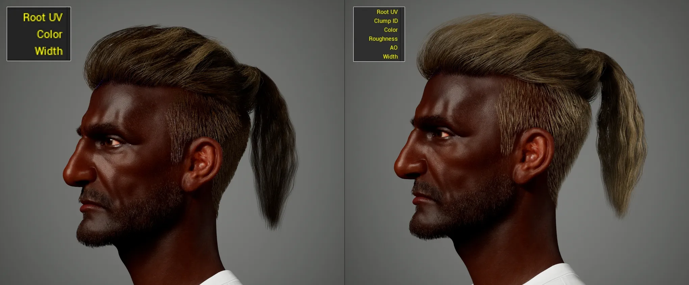  
*고급 렌더링 속성 잠금 해제 (v1.1.0 업데이트)*

  
*Unreal Engine MetaHuman 베이스 템플릿 Groom 에셋*

  
*GroomForge v1.4.0으로 생성 및 가져온 Groom 에셋*

### 1. 주요 개요
- **정밀한 데이터 변환:** Unreal Engine이 인식하는 Guide (값: 1) 및 Strand (값: 0) 속성을 완벽하게 구분하고 제어합니다.
- **루트 정렬:** 수천 개의 헤어 커브 루트를 타겟 메시(두피) 노멀에 자동으로 정렬하여 시뮬레이션 안정성을 보장합니다.
- **자동화된 리깅 파이프라인:** 헤어 액세서리 생성부터 가이드 커브 기반 본 리깅까지 모든 것을 자동화합니다.
- **MetaHuman 호환 헤어 카드 엔진:** 엔진 내 생성기보다 빠른 카드 생성, 길이 기반 패킹 및 컬러 가이드 UV 배치를 지원합니다.
- **UE 최적화 내보내기:** Root UV, ClumpID, Occlusion 등 엔진 렌더링에 필수적인 전문 속성을 자동으로 주입합니다.
- **🆕 Send to Unreal Engine:** 한 번의 클릭으로 헤어를 실행 중인 Unreal Engine 에디터에 완성된 Groom 에셋으로 직접 전송합니다 — 수동 파일 내보내기/가져오기 불필요.
- **🆕 자연스러운 위치 기반 클럼핑:** Clump ID가 이제 각 스트랜드의 실제 3D 위치에서 생성되므로, 물리적으로 가까운 스트랜드가 함께 그룹화되어 더 자연스럽고 뭉친 느낌을 제공합니다.

### 2. 사전 요구 사항 및 요구 조건
- **설치:** `Edit > Preferences > Add-ons > Install` → `GroomForge.zip` 선택 후 활성화.
- **권장 환경:** Blender 4.x / 5.x, Unreal Engine 5.x (최신 기능은 5.7 권장).
- **필요 데이터:** Blender Hair Curves (네이티브 또는 타사 애드온), 타겟 메시 (캐릭터 헤드 메시).

!!! warning
    ⚠️ **중요:** GroomForge v1.4.0은 **헤어 생성 도구가 아닙니다.**  
기존 헤어 커브를 Unreal Engine 5.x용으로 **정리, 가이드화, 리깅, 속성 설정, 내보내기**하는 파이프라인 애드온입니다.

### 🚀 크로스 플랫폼 성능 혁신
GroomForge는 플랫폼의 경계를 허물며 Windows와 Mac(M1/M2/M3) 환경 모두에서 최고의 성능을 제공하도록 설계되었습니다. 대규모 그루밍 데이터셋을 처리할 때도 엔진 수준의 안정성을 보장합니다.

- **비교할 수 없는 속도:** Mac에서 Blender 네이티브 기능 대비 **1.4배 빠른 처리 속도**를 달성했습니다. (100만 스트랜드 기준)
- **대규모 데이터 확장성:** 최대 **1000만 스트랜드(10M Strands)** 처리의 검증된 안정성.
- **완벽한 정밀도:** 모든 플랫폼에서 **정밀도 차이 0.0000000000**을 기록하여 절대적인 데이터 무결성을 보장합니다.

  
*AMD64 / arm64 아키텍처에서 Blender 4.5.8 LTS로 수행한 벤치마크*

---

## 작업 흐름

1. **헤어 커브 준비** — 스타일링 완료 및 스케일 적용 (`Ctrl+A`).
2. **타겟 메시 지정** — 헤어가 부착될 헤드 메시를 준비합니다.
3. **Root Align 실행** — 타겟 메시를 기준으로 커브 루트를 정밀하게 정렬합니다.
4. **가이드 설정 도구 사용** — **Fix & Output Connect**로 가이드 지정 및 노드 설정 자동화.
5. **가이드 컬러 뷰 확인** — 가이드와 스트랜드 구성을 시각적으로 검사합니다.
6. **(선택) 헤어 리그 프롭 생성** — 가이드 기반 액세서리 및 자동 리깅 생성.
7. **(선택) 헤어 카드 엔진 활용** — UE 호환 고속 헤어 카드 및 UV 레이아웃 생성.
8. **고급 Groom 내보내기 실행** — **Add Missing Attributes**로 최종 렌더링 속성을 주입하고 Alembic 내보내기.
9. **Unreal Engine 5.x에서 적용** — Groom 에셋 가져오기 및 검증 (필요시 5.7 Dataflow와 통합).

---

## 기술 매뉴얼 및 기능

### 1. GroomForge 설치 방법
상단 메뉴에서 **Edit > Preferences**로 이동합니다.  
**Add-ons** 탭 선택 → **Install...** 클릭 → `GroomForge.zip` 선택 → **Install Add-on** 클릭.  
"GroomForge"를 검색하고 체크박스를 선택하여 활성화합니다.

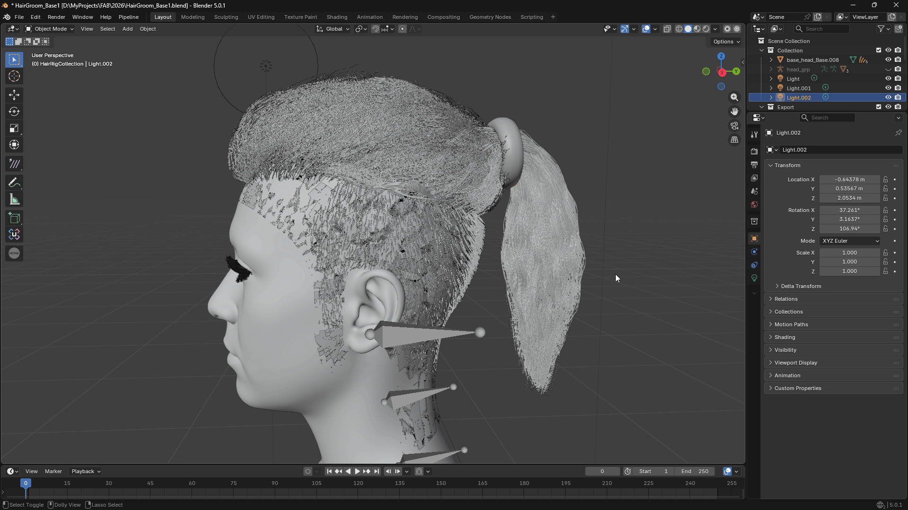

---

### 2. Root Align: 원클릭 루트 정렬
수천 개의 커브 방향을 수동으로 수정하는 지루한 작업을 제거하고 Unreal에서의 부착 정밀도를 보장합니다.

- **사용 방법:** Hair Curves 선택 → 타겟 메시 선택 → **Root Align** 클릭.
- **정밀도:** 메시에 가장 가까운 점을 자동으로 식별하여 Root로 설정, 헤어가 떠 있거나 루트와 팁이 뒤바뀌는 시뮬레이션 오류를 방지합니다.

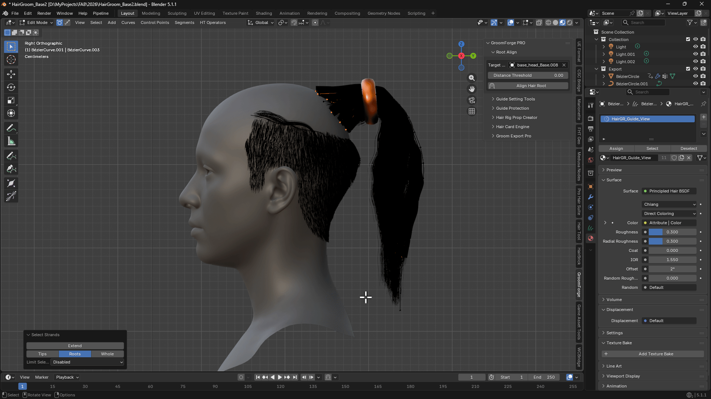  
*커브의 시작점과 끝점이 뒤바뀌어 있어도 타겟 메시(머리)에 가장 가까운 점을 자동으로 식별하여 Root를 재설정하고 방향을 올바르게 재정렬합니다.*

---

### 3. 가이드 설정 도구 & 픽스 도구 (속성 보호)
Unreal Groom 시스템에 필요한 Guide 속성을 정밀하게 정의하고 보호합니다.

- **Guide 1 / 0:** 선택한 커브를 가이드로 수동 지정/해제.
- **Select 1 / 0:** 현재 가이드를 빠르게 선택하거나 선택을 반전.
- **Random Guide:** 헤어의 특정 비율을 무작위로 가이드로 변환.

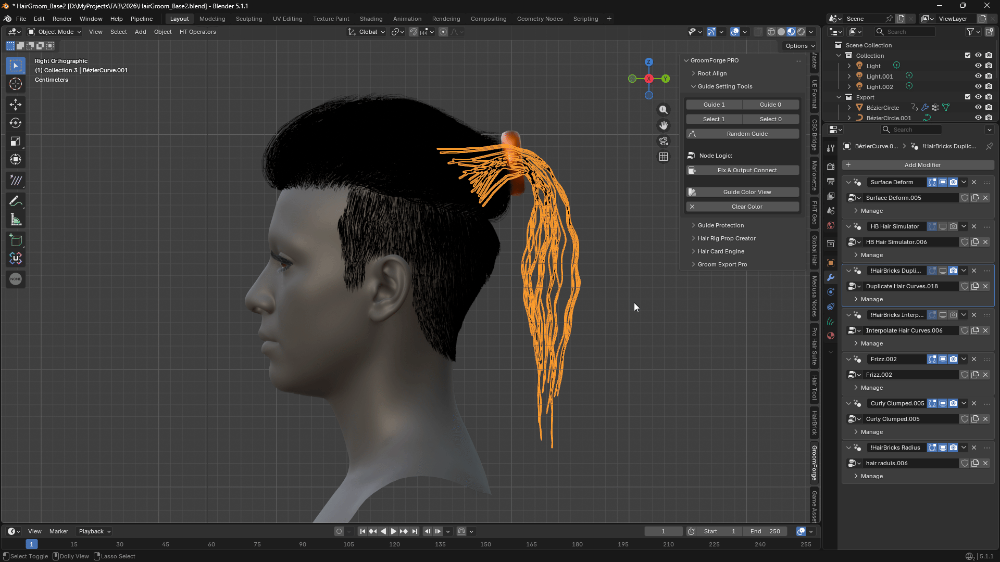

**🆕 Fix & Output Connect:** Geometry Nodes 내에서 Guide 속성이 스트랜드로 "번지는" 것을 방지하는 데 필요한 노드 구조를 자동으로 구축합니다.

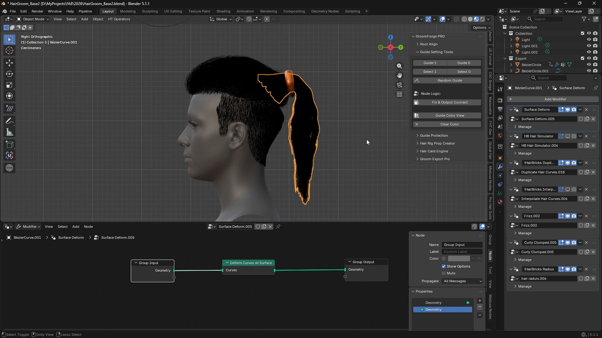  
*Blender 헤어 애드온 사용 시 (예: HairBRIC, Hair Tool)*

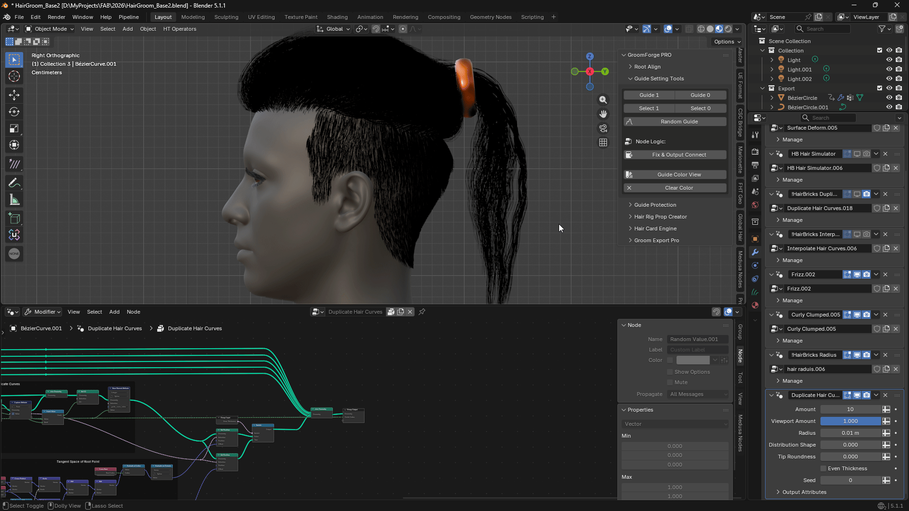  
**네이티브 Blender 헤어 노드(Geometry Nodes) 사용 시**

**💡 프로 팁:** 이 기능은 **HairBRIC** 애드온과 함께 사용할 때 가장 직관적으로 작동합니다.

**🆕 Clump Scale:** **Fix & Output Connect** 버튼 바로 옆에 **Clump Scale** 슬라이더가 있습니다. 자동으로 생성되는 헤어 클럼프의 크기를 제어합니다 — 값이 낮을수록 더 크고 굵은 클럼프가 생성되고, 값이 높을수록 더 작고 미세한 클럼프가 생성됩니다. 조정한 후 **Fix & Output Connect**를 다시 실행하여 차이를 확인하세요. 이제 클럼프는 각 스트랜드의 실제 3D 공간 위치를 기반으로 하므로, 가까운 스트랜드가 무작위로 그룹화되는 대신 자연스럽게 함께 그룹화됩니다.

---

### 4. 가이드 컬러 뷰 (시각적 검사)
내보내기 전 데이터 구성의 최종 시각적 검증. (가이드: 빨간색, 스트랜드: 파란색)

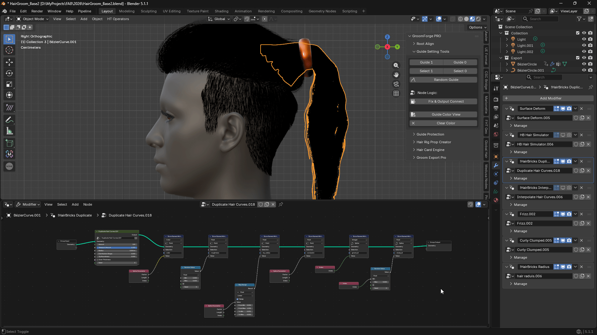  
**Blender 헤어 애드온 사용 시 (예: HairBRIC, Hair Tool)**

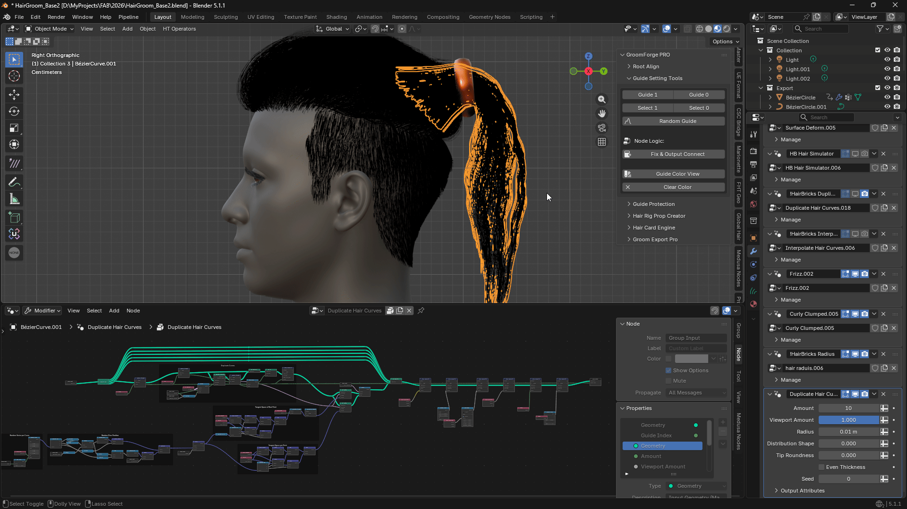  
**네이티브 Blender 헤어 노드(Geometry Nodes) 사용 시**

!!! warning
    ⚠️ **경고: 뷰포트 vs 실제 데이터**  
Blender Geometry Nodes의 특성상 실시간 뷰포트 표시가 실제 내보내기 데이터와 다를 수 있습니다. 컬러 뷰는 전반적인 분포와 흐름 확인용으로 사용하고, 최종 데이터는 항상 Unreal Engine 내에서 검증하세요.

---

### 5. 가이드 보호
이 패널은 가이드 데이터의 의도하지 않은 변경을 방지하고 전체 데이터 무결성을 검사하는 도구를 제공합니다.

- **Fix Guide Count:** 현재 설정된 가이드 수를 잠급니다.
- **Hair Debug Info:** 헤어 커브의 현재 데이터 상태를 표시합니다.

**💡 프로 팁:** 모든 가이드 설정을 완료하고 **Fix & Output Connect**를 실행한 후 **Fix Guide Count**를 클릭하는 것이 좋습니다.

---

### 6. 헤어 리그 프롭 생성기 (자동화된 리깅 파이프라인)
가이드 커브를 물리적 골격으로 사용하여 액세서리 생성과 리깅을 자동화합니다.

- **🆕 타겟 본 선택:** 아마추어 내 특정 본을 직접 선택할 수 있습니다.
- **🆕 랜덤 스케일:** 자연스러운 시각적 변화를 위해 인스턴스 크기를 무작위화합니다.
- **🆕 강제 UE 스케일 (100x):** GroomForge는 타겟 아마추어가 Unreal 스타일 센티미터 스케일을 사용하는지 자동으로 감지하고 이를 보정합니다. 어떤 이유로 올바르게 감지되지 않으면 이 상자를 체크하여 수동으로 올바른 스케일을 강제합니다.

  
*사용자가 선택한 단일 메시를 가이드 커브를 따라 정밀하게 배치합니다.*

  
*컬렉션의 여러 메시를 무작위 간격과 스케일로 자동 산포합니다.*

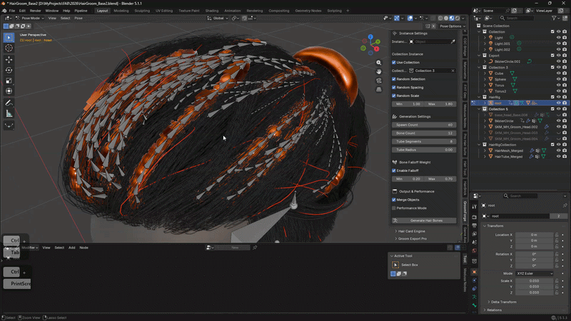  
*가이드 커브 기반 자동 리깅 및 본 시스템의 시각적 결과.*

*🆕 엣지 기반 리깅: 커스텀 골격 레이아웃을 위해 Edit Mode에서 선택한 엣지를 기반으로 리그 구조를 자동 생성합니다.
<video width="100%" controls>
  <source src="../assets/edge_rig.mp4" type="video/mp4">
</video>

---

### 7. 헤어 카드 엔진 (고속 카드 생성)
Unreal MetaHuman 헤어 카드 생성기의 느린 생성 속도를 보완하는 기술적 솔루션입니다.

- **LOD 호환성:** MetaHuman의 LOD 시스템과 완벽하게 동기화되도록 특별히 설계되었습니다.
- **UV 컬러 프로젝션:** UE 생성 맵의 컬러 분리 데이터를 사용하여 카드 UV를 자동으로 매핑합니다.

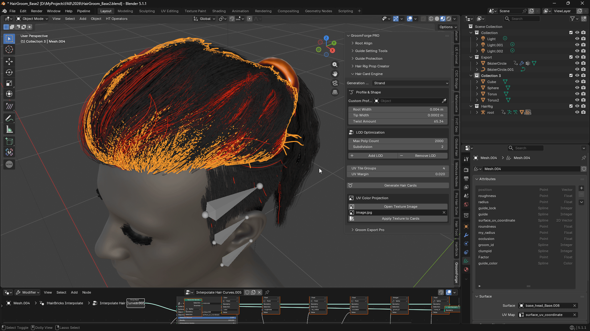  
*프로필 커브 또는 베이스 커브를 기반으로 즉시 헤어 카드를 생성합니다.*

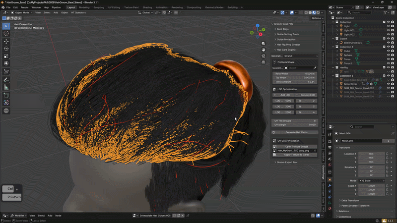  
*Unreal Engine의 LOD 시스템과 완벽하게 호환되는 단계별 헤어 카드를 생성합니다.*

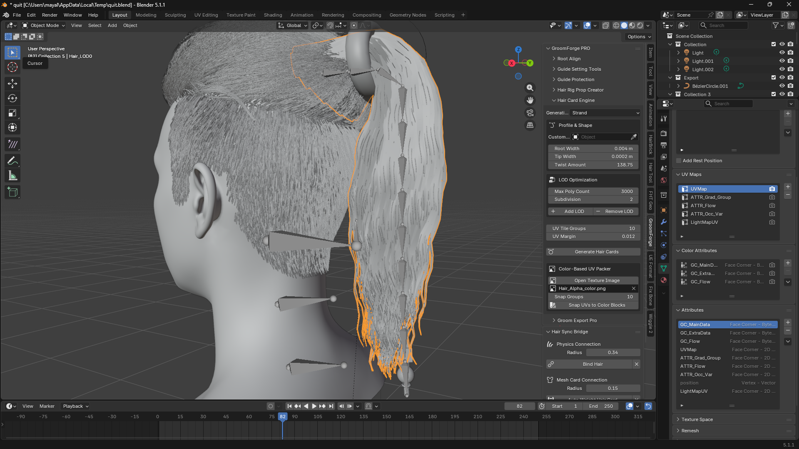 
 헤어 카드 생성 중 UE 호환 속성(UV 맵, 컬러 속성, 버텍스 데이터)을 자동으로 생성합니다. 
 Flow 맵, 그래디언트 그룹, Occlusion 변형과 같은 사전 구성된 데이터로 Unreal의 헤어 셰이더로 원활하게 전환됩니다.

<video width="100%" controls preload="metadata">
  <source src="../assets/card_re.mp4" type="video/mp4">
  브라우저가 video 태그를 지원하지 않습니다.
</video>
*컬러 가이드 이미지를 사용하여 수천 개의 헤어 카드 UV를 자동으로 배치하고 정렬합니다.*

💡 전문 최적화 팁: 가볍게 유지하세요!

특히 대규모 데이터셋(예: 1,000,000+ 스트랜드)을 다룰 때 최상의 성능을 보장하려면 다음 지침을 따르세요:
권장 해상도: 256px ~ 512px.
왜 저해상도를 사용하나요?
이 도구는 텍스처 디테일이 아닌 공간 영역을 분석합니다. 더 큰 이미지(예: 4K)는 정렬 정밀도를 높이지 않고 중복 픽셀 계산만 증가시킵니다.

256px 가이드 이미지를 사용하면 메모리 오버헤드가 크게 줄어들고 처리 시간이 빨라져 극한의 스트랜드 수에서도 거의 즉각적인 UV 스냅이 가능합니다.

!!! note
    모범 사례: 컬러 가이드를 저해상도 PNG로 저장하여 작업 흐름 효율성을 극대화하세요.
    "픽셀을 계산에 낭비하지 마세요. 낮은 해상도는 데이터 손실 없이 더 빠른 결과를 의미합니다."

---
### 8. 고급 Groom 내보내기 (속성 주입의 핵심)
Blender 커브를 Unreal Engine이 즉시 이해하는 "진짜 Groom" 데이터로 변환합니다.

- **🆕 Add Missing Attributes:** 한 번의 클릭으로 모든 필수 렌더링 속성 노드를 생성하고 주입합니다: **ClumpID, Occlusion, Roughness, Root UV**.

  
*하나 또는 여러 개의 헤어 커브를 선택하여 단일 Alembic 파일로 내보냅니다.*

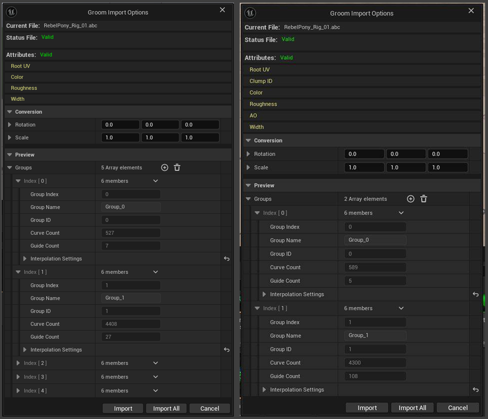  
**더 많은 속성, 더 나은 비주얼**

**💎 시각적 검증: MetaHuman 셰이딩 호환성**  
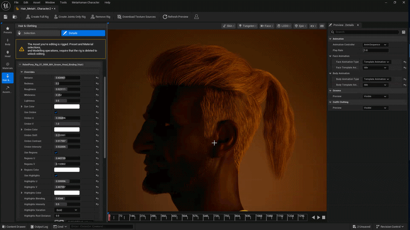  
*GroomForge의 Root UV 주입은 100% 정확하여 MetaHuman Creator에서 직접 실시간 Ombre 및 Highlight 조정이 가능합니다.*

---

### 🆕 8.1 사전 계산된 가이드 가중치 (실험적)

기본적으로 꺼져 있는 독립적인 내보내기 옵션으로, Unreal Engine이 자체적으로 처음부터 다시 계산하는 대신 Blender의 자체 가이드-투-스트랜드 보간을 재현할 수 있게 합니다.

- Groom 내보내기 패널의 자체 **"Advanced (Experimental)"** 박스에 있습니다 — 위의 일반 **Guide** 체크박스와는 별개입니다. 이 기능을 원하지 않으면 체크하지 않은 채로 두고(또는 내보내기 시 **Guide** 체크 해제) 정상적으로 내보내면 됩니다.
- 활성화하면 두 개의 슬라이더가 나타납니다:
  - **Target Segment Length** — 모든 스트랜드에 고정된 점 개수 대신 각 커브가 대략 이 세그먼트 길이를 가지도록 리샘플링되므로, 짧은 스트랜드는 과도하게 세분화되지 않고 긴 스트랜드는 과소 세분화되지 않습니다. 기본값 `0.2`.
  - **Guide Influence Radius** — 가이드가 스트랜드 루트에서 영향을 미칠 수 있는 최대 거리. 이 반경 내에 가이드가 없는 스트랜드는 멀리 떨어진 관련 없는 가이드에 잘못 강제되는 대신 **시뮬레이션 가중치가 0**이 됩니다. 기본값 `0.002`, MetaHuman 스케일(센티미터, `0.01` 스케일) 리그에 맞게 조정됨 — 다른 스케일로 작업하는 경우 리그에 맞게 조정하세요.

!!! tip
    💡 **가이드 배치가 시뮬레이션되는 범위를 결정합니다.** 범위 밖의 스트랜드는 시뮬레이션 가중치가 0이 되므로, 가이드를 배치하는 위치만 선택하면 Unreal 시뮬레이션에서 움직일 헤어 영역을 정확히 결정할 수 있습니다 — 앞머리나 포니테일만 필요하다면 머리 전체를 시뮬레이션할 필요가 없습니다.

!!! warning
    ⚠️ 이 기능은 **실험적(Experimental)** 기능입니다. 표준 Guide/Strand 내보내기와 완전히 독립적입니다 — 활성화해도 일반 **Guide** 체크박스의 동작은 변경되지 않습니다.

---
## 9. 헤어 커브-투-메시 바인딩 (애니메이션 지원)

Blender에서 Hair Curves를 Armature에 직접 페어런트하거나 바인딩할 수 없는 **기술적 한계를 극복**합니다. 이 기능은 커브를 메시 데이터에 바인딩하여 간극을 메우고, 헤어가 복잡한 캐릭터 애니메이션을 완벽하게 따라가도록 보장합니다.

### 주요 특징
*   **✨ 완벽한 싱크**
    메시 변형을 상속하여 모션 중에 헤어 커브가 바디와 정렬된 상태를 유지합니다.
*   **🛠️ 기술적 솔루션**
    헤어 커브를 위한 전문 리깅 워크플로우를 가능하게 하는 자체 개발 파이프라인.
*   **⚡ 효율적인 워크플로우**
    근접성 기반의 빠른 바인딩으로 빠른 애니메이션에서도 안정적인 결과 보장.

<video width="100%" controls>
  <source src="../assets/Hair_bind1.mp4" type="video/mp4">
</video>

<video width="100%" controls>
  <source src="../assets/Hair_bind2.mp4" type="video/mp4">
</video>

---

## 🆕 10. Unreal Engine으로 보내기 (베타)

"수동으로 Alembic 내보내기 → Unreal로 전환 → 파일 가져오기" 루틴을 완전히 건너뜁니다. **Send to Unreal Engine**은 헤어를 내보내고 실행 중인 Unreal Engine 에디터 내부에 완성된 Groom 에셋을 한 번의 클릭으로 생성해 줍니다.

### 일회성 설정 (Unreal Engine에서)

이 기능을 처음 사용하기 전에 Unreal Engine에서 다음을 수행하세요:

1. **Edit > Plugins**로 이동하여 **"Python Editor Script Plugin"**을 검색하고 **활성화**되어 있는지 확인하세요. 방금 활성화했다면 Unreal Engine을 다시 시작하세요.
2. **Edit > Editor Project Settings**로 이동하여 검색창에 **"Python"**을 입력하고 **"Enable Remote Execution"**을 체크하세요.
3. 방금 이 상자를 체크했다면 연결이 수신 대기를 시작할 수 있도록 Unreal Engine을 다시 시작하세요.

Unreal Engine 프로젝트/설치당 한 번만 수행하면 됩니다.

### 사용 방법

1. Blender에서 완성된 Hair Curves를 선택하세요 (**Export Mode**가 **Unreal Engine**으로 설정되어 있는지 확인).
2. **Groom Export Pro** 패널에서 **"Send to Unreal Engine (Beta)"** 박스를 찾으세요.
3. 다음을 입력하세요:
   - **UE Folder** — Unreal 프로젝트의 Content Browser 폴더로, Groom 에셋이 생성될 위치입니다 (예: `/Game/Hair`). 폴더만 입력하고 여기에 파일 이름은 추가하지 마세요.
   - **Asset Name** — 가져온 Groom 에셋에 부여할 이름입니다 (예: `MyCharacter_Hair`). 비워 두면 GroomForge가 Blender 파일 이름을 기반으로 자동으로 이름을 지정합니다.
4. Unreal Engine이 (같은 컴퓨터에서) 프로젝트를 로드한 상태로 열려 있는지 확인하세요.
5. **Send to Unreal Engine**을 클릭하세요. GroomForge가 헤어를 내보내고 Groom 에셋이 지정한 폴더/이름으로 Content Browser에 자동으로 나타납니다.

**💡 팁:** 첫 번째 전송이 성공한 후 GroomForge는 남은 Blender 세션 동안 연결을 기억하므로, 반복 전송(예: 헤어를 수정한 후)은 훨씬 빠르게 연결됩니다.

!!! warning
    ⚠️ 이 기능은 Blender와 Unreal Engine이 **같은 컴퓨터**에서 실행 중일 때만 작동하며, Unreal Engine 내에서 위의 일회성 설정이 완료되어 있어야 합니다. 현재 **베타** 기능입니다 — 전송이 실패하면 Blender 상태 표시줄의 오류 메시지를 확인하세요. 무엇을 확인해야 하는지 알려줍니다.

---

## 문제 해결 (FAQ)

- **Q:** UE에서 헤어 방향이 반대로 표시됩니다. → **A:** `Root Align`을 다시 실행하고 타겟 메시를 확인하세요.
- **Q:** 가이드 구성이 어색해 보입니다. → **A:** `Guide Setting Tools`에서 가이드 가중치와 노드 연결을 다시 확인하세요.
- **Q:** 가져온 후 속성이 누락되었습니다. → **A:** 내보내기 전에 `Add Missing Attributes`를 클릭했는지 확인하세요.
- **Q:** 스케일 또는 위치 문제. → **A:** Blender에서 `Apply Scale`이 수행되었는지 확인하세요.
- **Q:** `Send to Unreal Engine` 사용 시 "No Unreal Engine Editor found" 오류. → **A:** Unreal Engine이 같은 컴퓨터에서 실행 중인지, 그리고 일회성 설정을 완료했는지 확인하세요: **Python Editor Script Plugin** 활성화 및 Editor Preferences에서 **Enable Remote Execution** 체크 (설정 변경 후 UE 재시작).
- **Q:** 헤어 클럼프가 너무 크거나 작게 보입니다. → **A:** `Fix & Output Connect` 옆의 **Clump Scale** 슬라이더를 조정하고 다시 실행하세요.

---

## 권장 작업 흐름 요약

Blender 헤어 스타일링 → 2. 타겟 메시 지정 → 3. Root Align → 4. 가이드 설정 → 5. 컬러 뷰 검사 → 6. (선택) 리그 프롭 생성 → 7. (선택) 헤어 카드 엔진 → 8. 내보내기 (누락 속성 주입) → 9. Unreal Engine 5.x로 가져오기 (수동, **또는** **Send to Unreal Engine**으로 원클릭) → 10. (필요시) UE 5.7 Hair Dataflow 활용 → 11. 최종 적용

---

## 최종 내보내기 체크리스트

- [ ] 헤어 커브 완성 및 스케일 적용
- [ ] **Root Align** 수행
- [ ] **Fix & Output Connect** 실행
- [ ] (카드 사용 시) **UV Color Projection** 적용
- [ ] **Add Missing Attributes** 클릭
- [ ] 엔진 가져오기 후 Groom 에셋에서 속성이 올바르게 인식됨
- [ ] (**Send to Unreal Engine** 사용 시) UE 일회성 설정 완료: Python Editor Script Plugin 활성화 + Enable Remote Execution 체크

---

## 요약

> **GroomForge v1.5.0은 Blender 그루밍 데이터를 Unreal Engine 5.x 표준 Groom 시스템에 완벽하게 최적화하고 하이엔드 결과에 필요한 속성을 주입하는 전문 파이프라인 솔루션입니다.**

---

*MkDocs Material로 제작 • 단일 파일 GroomForge Wiki*