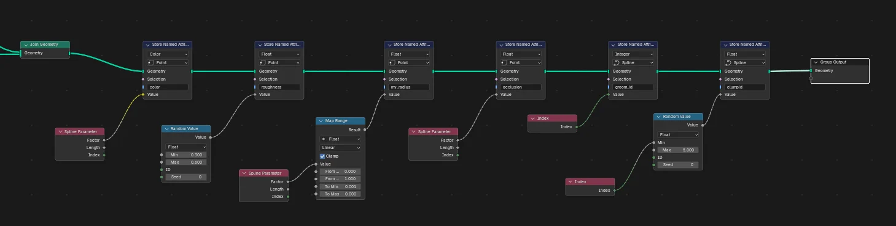
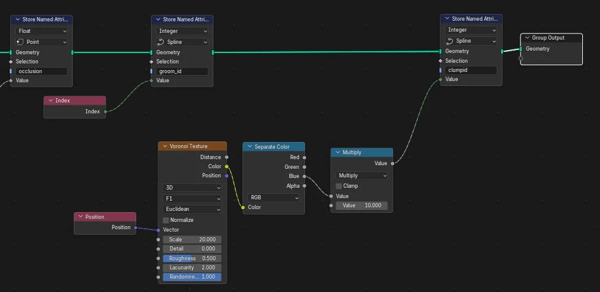
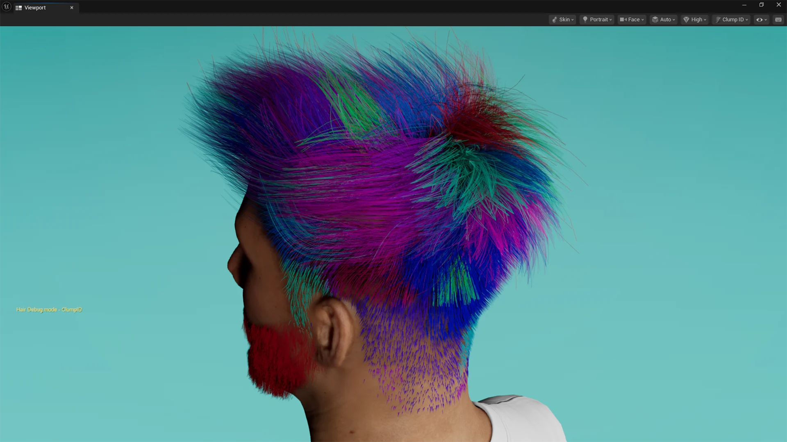

# Welcome to GroomForge

For full documentation visit [superhivemarket.com](https://superhivemarket.com/products/groomforge).

  <iframe width="640" height="360" src="https://www.youtube.com/embed/GdUoXGK6g4E" title="[ Professional Hair Physics for Blender &amp; UE5 | Groomforge Addon Showcase ]" frameborder="0" allow="accelerometer; autoplay; clipboard-write; encrypted-media; gyroscope; picture-in-picture; web-share" referrerpolicy="strict-origin-when-cross-origin" allowfullscreen></iframe>

---
## Update News

## 🚀 Version 1.4.0 Update

### New Features & Improvements
*   **🆕 Send to Unreal Engine (Beta)**  
    A brand-new one-click bridge between Blender and a running Unreal Engine Editor. Instead of manually exporting an Alembic file and importing it in UE by hand, just click **Send to Unreal Engine** — GroomForge exports your hair and automatically creates the Groom asset inside UE for you, no file dialogs or manual import steps required.
    - Works when Blender and Unreal Engine are running on the **same computer**.
    - Requires a one-time setup in UE: enable the **Python Editor Script Plugin** and turn on **Enable Remote Execution** in Editor Preferences (see the User Guide for the exact steps).
    - You can choose the **UE Folder** and **Asset Name** directly from the Blender panel, so the imported Groom asset lands exactly where — and named however — you want.
    - After the first successful send, repeated sends to the same UE session are much faster, since GroomForge remembers the connection for the rest of your Blender session.

*   **🆕 Smarter, More Natural Clump Grouping**  
    The auto-generated “clumpid” attribute (created by **Fix & Output Connect**) now groups strands by their actual 3D position instead of just their internal list order, so strands that are physically close together now share the same clump ID — giving a much more natural, bundled look. A new **Clump Scale** slider next to the **Fix & Output Connect** button lets you control how large or small the clumps are.

*   **🆕 Richer Unreal Groom Data on Export**  
    Groom Export now includes extra guide-interpolation data (`groom_closest_guides` / `groom_guide_weights`) and standard Groom version info, giving Unreal Engine more information to interpolate your strands from the guides more accurately.

*   **🆕 Force UE Scale Option**  
    A new **Force UE Scale (100x)** checkbox in Hair Rig Prop Creator lets you manually force the correct scale compensation for Unreal-style (centimeter) armatures, in case it isn't detected automatically.

### Bug Fixes
*   **Fixed:** Hair bones could be generated in the reversed direction when using Guide Curves in Hair Rig Prop Creator.
*   **Fixed:** Generated hair meshes/tubes could come out **100x too large** when targeting an Unreal-scaled (centimeter) Armature.
*   **Fixed:** The auto-generated “roughness” attribute could end up as a single identical value across the whole hair system instead of varying naturally per strand.
*   **Fixed:** Groom Export could fail unexpectedly in certain setups — export is now more robust and reliable.
*   Cleaned up a couple of unused leftover buttons in the UV Color Packer panel for a tidier UI.
*   General performance improvement for the Wiggle Hair Sync bridge in scenes with many objects.

---

## 🚀 GroomForge PRO v1.3 Release Notes

### [Bug Fix] Fixed 'Fix & Output Connect' Automation and Clump ID Issues
* **Issue:** Previously, when using the 'Fix' function to automatically generate the node setup, the `clumpid` attribute failed to calculate or apply correctly to the strands.
* **Fix:** Improved the internal logic of the `Fix & Output Connect` feature. The automatically generated `Store Named Attribute (clumpid)` node now properly fetches the `Random Value` data across the Spline domain and maintains a stable connection directly to the `Group Output`. Hair clumping effects will now display accurately per strand.

---

### 💡 Advanced Styling Tips & Use Cases

#### Procedural Clumping via Voronoi Texture Masking
For advanced styling, explore creative setups beyond the default node setup—such as layering multiple clump attributes for complex braids, realistic flyaways, or stylized layering.
* **Procedural Clumping:** Instead of simple random values, try using a `Voronoi Texture` mapped to the strand positions to generate spatially clustered clump IDs.
* **Realistic Clustering:** By passing the texture color through a `Separate Color` node and scaling it with a `Multiply` math node, you can procedurally group hair strands based on their physical proximity. This creates much more realistic, natural-looking hair clumps and partings.

---

### 🎬 Showcase: Procedural Clumping in Action
*Procedural Clumping via Voronoi Texture allows you to easily achieve realistic, engine-ready hair clustering.*
* **Advanced Spatial Clustering:** By driving the `clumpid` attribute with a procedural `Voronoi Texture`, hair strands are automatically clustered based on their 3D proximity rather than simple random generation.
* **Flawless Engine Integration:** As shown in the Unreal Engine viewport debug mode, each distinct color seamlessly visualizes a procedural clump unit. This data-driven approach yields incredibly natural hair breaks, realistic partings, and high-fidelity clumping behavior without any manual grooming overhead.
* **Production-Ready Efficiency:** This setup bridges the gap between Blender's procedural generation and real-time engine shading, giving you complete pipeline control over complex hairstyles.

---

## 🚀 Version 1.2.0 Update

### New Features & Improvements
*   **🆕 Edge-to-Rig Generation**  
    You can now generate professional rig structures directly from **selected edges** in Object Edit Mode. This allows for more flexible and custom skeleton layouts beyond standard curves.

*   **⚡ Enhanced Color UV Packing**  
    The Color UV Pack engine has been overhauled for **better precision and faster processing**. It ensures UV islands are snapped to color blocks more accurately with significantly reduced calculation time.
    
*   **🎮 Unreal Engine Pipeline Optimization**  
    Automatically generates UE-compatible attributes (UV Maps, Color Attributes, and Vertex Data) during hair card creation. This ensures a seamless transition to Unreal's hair shaders with pre-configured data such as Flow maps, Gradient groups, and Occlusion variations.

### Bug Fixes & Optimization
*   Improved internal logic for UV tile group distribution.
*   Minor UI/UX refinements for the property panels.

### 🔄 Advanced Binding System
*   **🆕 Hair Curve-to-Mesh Bind**  
    A specialized solution to bind Hair Curves to mesh data. This ensures hair follows complex character movements perfectly, overcoming the native limitation where curves cannot be directly influenced by an Armature.

*   **🆕 Mesh-to-Rig Bind**  
    Streamlined workflow to bind meshes to rigs (armatures). This feature optimizes the connection between your generated props and the skeletal system for stable animation.
