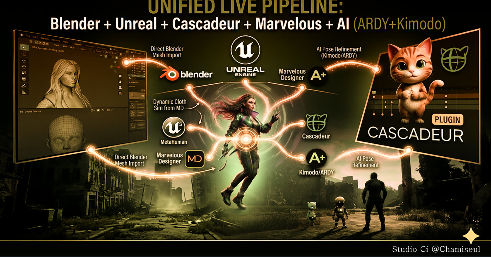
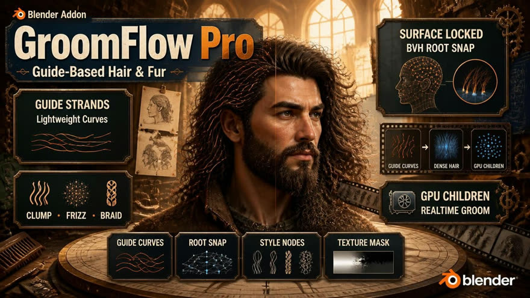
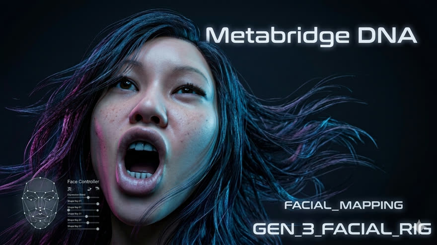
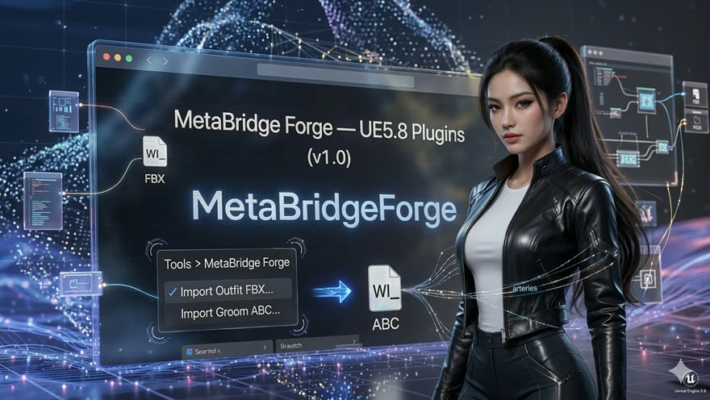
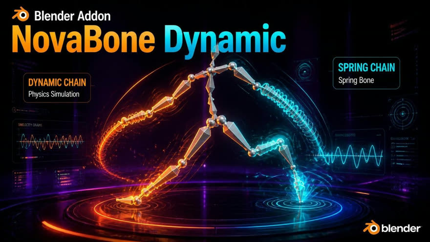
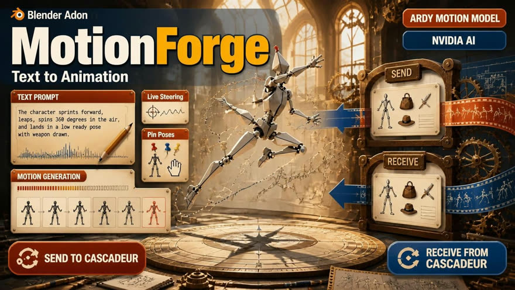
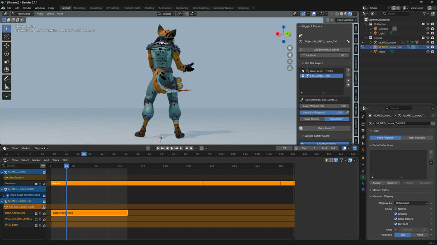
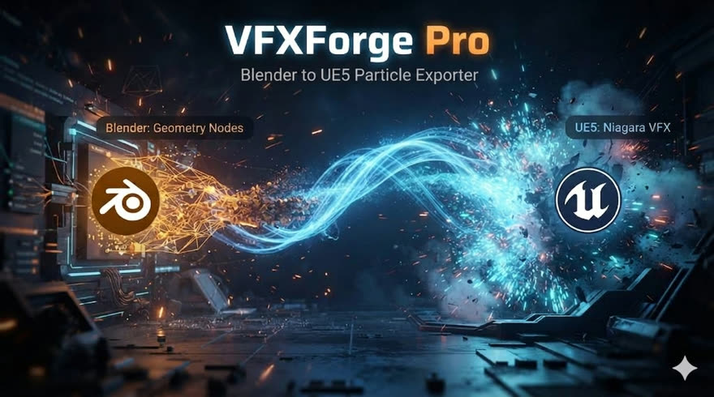
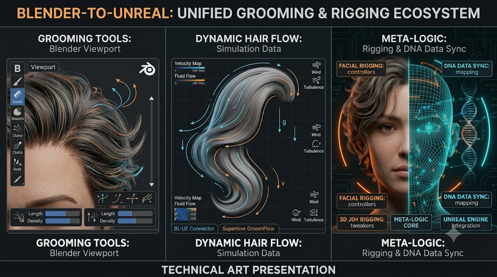

---
hide:
  - navigation
  - toc
---

{ .cs-hero-bg }

# Studio Ci — chamiseul

### One live pipeline: Blender · Unreal Engine · Cascadeur · Marvelous Designer

Character tools for people who ship. Hair and clothing items, MetaHuman data,
grooming, bone physics and animation — built to survive the trip from Blender
into Unreal Engine 5.7 / 5.8 with nothing lost on the way.

[:material-play-circle: Take the CLASS101 course](https://class101.net/ko/products/688d8d0b6a08dc6e2607efb6){ .md-button .md-button--primary }
[:material-cart: Superhive store](https://superhivemarket.com/creators/chamiseul){ .md-button }

:simple-blender: **Blender** 4.5 – 5.2 &nbsp;·&nbsp;
:simple-unrealengine: **Unreal Engine** 5.7 – 5.8 &nbsp;·&nbsp;
**MetaHuman** &nbsp;·&nbsp; **Cascadeur** &nbsp;·&nbsp; **Marvelous Designer**

## The course

### :material-school: MetaHuman 헤어·의상 제작 & FAB 판매 수익화 클래스

**Making MetaHuman hair and clothing, and selling it on Fab.** This is where
the whole toolset came from — every add-on on this page was written to teach
and to run this pipeline. Taught in Korean on CLASS101.

:material-content-cut: **Hair**
: Grooming in Blender from first strand to a finished MetaHuman-ready groom —
  guides, clumping, hair cards, and the export that survives Unreal.

:material-tshirt-crew: **Clothing**
: Garments in Marvelous Designer, brought back through Blender and fitted onto
  a MetaHuman body.

:material-unreal: **Unreal**
: Getting all of it into Unreal Engine 5.7 / 5.8 — grooms, wardrobe items,
  physics that behaves.

:material-cash-multiple: **Selling it**
: Packaging and publishing the result on Fab, which is the part most tutorials
  stop short of.

{ .cs-wide }

**Rated 4.7 from 11 reviews · #4 in Game Graphics on CLASS101 · ₩40,000/month
over 5 months**

[:material-play-circle: CLASS101](https://class101.net/ko/products/688d8d0b6a08dc6e2607efb6){ .md-button .md-button--primary }
[:material-account-heart: Patreon](https://www.patreon.com/c/ChamIseul){ .md-button }
[:fontawesome-brands-youtube: YouTube](https://www.youtube.com/@ChamIseul){ .md-button }

{ .cs-wide }

## Hair and clothing items

Finished, game-ready assets rather than tools: realistic grooms, beards,
braids and cornrows, and outfits — all built with the add-ons below and
prepared for MetaHuman.

[:material-storefront: Browse the items on Fab](https://www.fab.com/sellers/Chamiseul%20Studio%20Ci){ .md-button }

## The add-ons

### Hair

-   

    ### GroomForge PRO

    Blender Hair Curves into an Unreal groom Unreal actually reads. Injects the
    attributes UE needs, builds hair cards with baked textures, rigs guide
    curves into bones, and sends the result straight to a running editor.

    ---

    [:material-book-open-variant: Guide](guide.md) ·
    [:material-translate: 한국어](KO_index.md) ·
    [:material-cart: Store](https://superhivemarket.com/products/groomforge)

-   

    ### GroomFlow PRO

    Non-destructive grooming on top of Blender's native hair curves — braids,
    fur, cutting, hair ties, clump IDs and simulation you can freeze into the
    guides.

    ---

    [:material-book-open-variant: Guide](https://mayalhc.github.io/GroomFlow_Pro/) ·
    [:material-translate: 한국어](https://mayalhc.github.io/GroomFlow_Pro/KO_index/) ·
    [:material-cart: Store](https://superhivemarket.com/products/groomflow_pro)

### Character

-   

    ### MetaBridge DNA

    MetaHuman DNA in and out of Blender: correctives, rig retargeting,
    wearables weight transfer, bake to `.dna`, and live link to Unreal and
    Cascadeur.

    ---

    [:material-book-open-variant: Guide](https://mayalhc.github.io/metabridge_dna/) ·
    [:material-translate: 한국어](https://mayalhc.github.io/metabridge_dna/KO_index/) ·
    [:material-cart: Store](https://superhivemarket.com/products/metabridge_dna)

-   

    ### MetaBridge Forge

    An Unreal **editor plugin**. Pick one FBX or Alembic and it runs the whole
    MetaHuman outfit and groom preparation through to a verified Wardrobe Item,
    with no project content setup.

    ---

    [:material-book-open-variant: Guide](https://mayalhc.github.io/MetaBridgeForge_Wiki/) ·
    [:material-cart: Store](https://mayalhc.gumroad.com/)

### Motion

-   

    ### NovaBone Dynamics

    Scale-independent bone-chain physics for hair, tails, skirts, accessories
    and jiggle bones. Pick a chain's first and last bone; it simulates, collides
    and bakes to keyframes.

    ---

    [:material-book-open-variant: Guide](https://mayalhc.github.io/novabone/) ·
    [:material-translate: 한국어](https://mayalhc.github.io/novabone/KO_index/) ·
    [:material-cart: Store](https://superhivemarket.com/products/novabone-dynamics)

-   

    ### MotionForge

    Motion generation and cleanup inside Blender, with a two-way live link to
    Cascadeur and retargeting onto your own rigs.

    ---

    [:material-book-open-variant: Guide](https://mayalhc.github.io/motionforge/) ·
    [:material-translate: 한국어](https://mayalhc.github.io/motionforge/KO_index/) ·
    [:material-cart: Store](https://superhivemarket.com/products/motionforge)

-   

    ### Wiggle 2: RTX Edition

    The layered bone physics engine, maintained for current Blender versions
    after the original was discontinued.

    ---

    [:material-book-open-variant: Guide](https://mayalhc.github.io/Wiggle2-RTX/) ·
    [:material-newspaper: News](https://mayalhc.github.io/Wiggle2-RTX/news/)

### Effects

-   

    ### VFXForge PRO In development

    Particle and VDB effects built on Geometry Nodes, aimed at output a game
    engine can take. Not released yet — the guide is published as it is written.

    ---

    [:material-book-open-variant: Guide](https://mayalhc.github.io/VFXForge_PRO_Guide/)

## How it fits together

{ .cs-wide }

---

!!! question "Which one do I need?"

    **Styling the hair** → GroomFlow PRO.
    **Getting that hair into Unreal** → GroomForge PRO.
    **Making it move** → NovaBone Dynamics.
    **MetaHuman character data** → MetaBridge DNA in Blender, MetaBridge Forge in Unreal.
    **Animation** → MotionForge. **Effects** → VFXForge PRO.

---

## Where to find everything

| | |
|---|---|
| **Superhive Market** | [superhivemarket.com/creators/chamiseul](https://superhivemarket.com/creators/chamiseul) — the Blender add-ons |
| **Fab** | [Chamiseul Studio Ci](https://www.fab.com/sellers/Chamiseul%20Studio%20Ci) — hair and clothing items, plus the add-ons |
| **Gumroad** | [mayalhc.gumroad.com](https://mayalhc.gumroad.com/) — every add-on, including MetaBridge Forge for Unreal |
| **ArtStation** | [artstation.com/chamiseul/store](https://www.artstation.com/chamiseul/store) |
| **CLASS101** | [MetaHuman 헤어·의상 제작 & FAB 판매 수익화 클래스](https://class101.net/ko/products/688d8d0b6a08dc6e2607efb6) |
| **Patreon** | [patreon.com/c/ChamIseul](https://www.patreon.com/c/ChamIseul) |
| **YouTube** | [@ChamIseul](https://www.youtube.com/@ChamIseul) |
